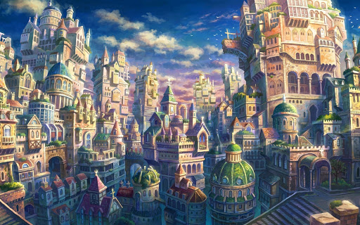
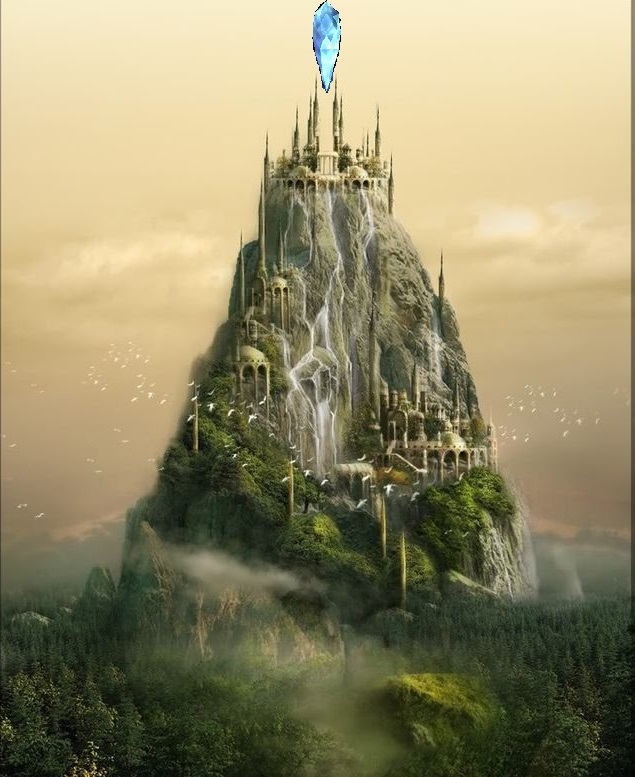

# Kingdoms and Races  

Of course, the world of Elestra is filled with all varieties of peoples. These peoples have divided themselves, oft on the basis of race, into various political systems. These systems, typically referred to as kingdoms, are the governing organizations of various territories.  

## Solen {-}  

This, as has been for some time, is the largest human kingdom. Their main capital city is Dawnhold, located in the central continent.The Solen Language has become so wide spread almost all know at least a little of it.  

Royal Family:  

-   King Aris Dawn  
  
-   Queen Margeleen Dawn  
  
-   Prince Evren Dawn  
  
-   Princess Lilieana Dawn  
  
-   Sir Arther Forge*    
  

*Forge is the surname bestowed upon bastards, since they can never take the throne (nor hold any royal title). In other words, they must "forge" their own path.  

Capital: Dawnhold  

## The Free City {-}  

Founded 1,000 years ago by wealthy merchants, the Free City stands as a port of independent trade. A safe port for all, it has become a major trading hub for the whole world. People of all kingdoms and races frequent the Free City, making it a burgeoning place of scholarship as well.    

  

Ruler:

-   Queen elect Cresta  

  

## The Five Cities {-}  

Founded 5,000 years ago by the Council of Five, it started out as a colonization effort by a civilian organization from Solen that eventually turned into a new, independent sovereign realm. The five cities are allied in a sort of republic, with the role of the chief executive belonging to the High Archon.   

The High Archon is elected out of the five Archons, to serve for a period of ten years. Each city is lead by a Archon who rules for life. When one dies, a new one is elected by vote of the populace.  

Current Archons:  

-   High Archon Hadin of Unin the City of Terraces  

  
  

-   Archon Aurvandi of Linvo the City of Canals  

  

  

-   Archon Mezra of Nokgah the City of Flowers

  

  

-   Archon Galent of Kirkin the City of Color  

  

  

-   Archon Jesnia of Ezira the City of Silver  

  

  

## Inar'uthwe {-}  

Rulers:  

-   High King Ry'el Aeon  

  
-   High Queen Seleen Aeon  

  
-   Prince Etha'las Aeon  

  

Capital: Elino'thunin (city of many waterfalls)  

  

## Kingdom of Anor {-}  

Rulers:  

-   Queen Elioneea Stormwind  

  

-   Consort King Chivalry  

  

-   Princess Alowen  

  

Capital: Dragonreach  

  

## Cathar {-}  

A race born about 8,000 years ago, they emerged on the island of Cathar. They are renowned as a fierce warrior race with deep traditions. Young members of this race have to go through a great hunting trial to be considered an adult.

Rulers:  

-   King Razgash  

  

-   King in waiting Naktas  

  

Capital: Kasvel  

## The Elsitan {-}  

A race rarely seen and rarely heard even of, they live in what humans have termed "Deep City", since it lays deep beneath the scar area on the western continent.  

  

They seem to be a race of sentient automatons, and the city they live in is even a rebuilt old *Thene'we* ruin. However, it is considered to be the most true example of what a city of that people looked like.  The Elsitan themselves seem to have no knowledge of how they were made, though they do know they were servants of the *Thene'we* that they call the "Masters". They also seem to have lost all understanding as how to make more of their race, and so there are only some 50,000 of their people left.  

Ruler: Unknown  

Capital: “Deep city” (in the Solen language, real name unknown)  

## Grell {-}  

A race about 13,000 years old, they are truly gentle giants. They stand 7' to 8' tall, and seem to have a deep connection with nature and the land. They first encountered the Natu, and both races became quick friends and have formed a deep alliance and bond with each other.  

Their culture is very tribal in nature, and focused on healing and growing things. However, they are fierce opponents if angered - one Grell has been known to take out a whole squad of human infantry on its own.  

  

Some scholars have speculated that the vile Unok are the twisted manifestations of this race.  

Ruler: Some kind of moot where prominent shamans make decisions  

Capital: None, each settlement is self ruling   

## Lizzard Folk {-}  

Lizzard folk come in many shapes and sizes there is even one tribe that can spit poison. In fact, some say they are descended from the dragons - and they have come to take this belief into their culture. Lizzard folk will worship Dragons at times, even going so far to think that they are the Maker's main servants.  

Lizzard folk have been at war with the Cathar for forever (rather, as long as I can find records for).  

  

Capital: Etzaquoxa  

A minor race, the Frogels, cohabitate the island with the Lizzard folk. They primarily try to trade with the Lizzard folk; however, they are not above ambushing a caravan when greatly advantaged.  

  