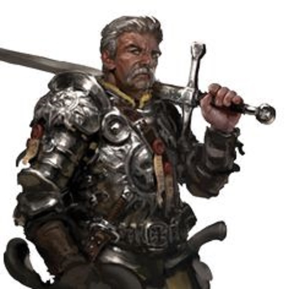
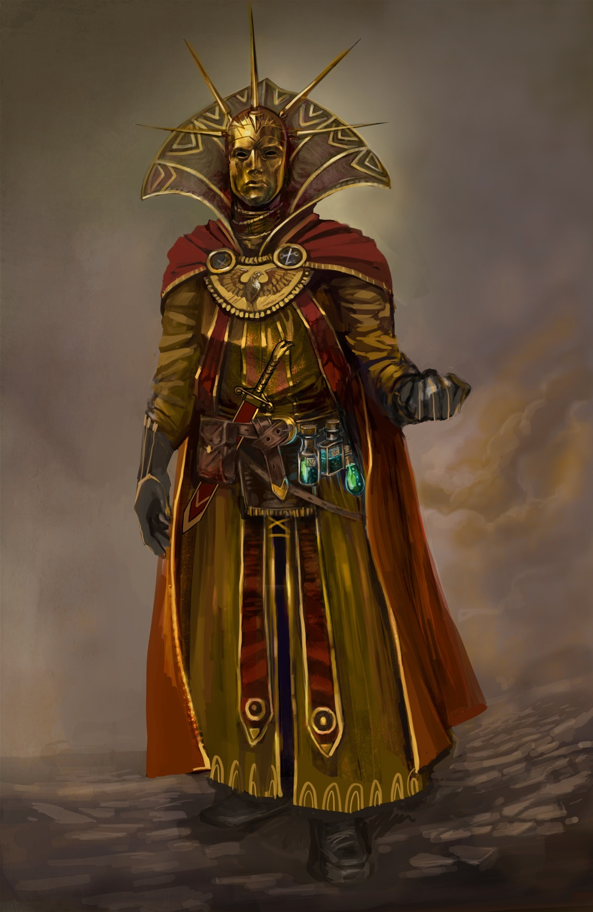
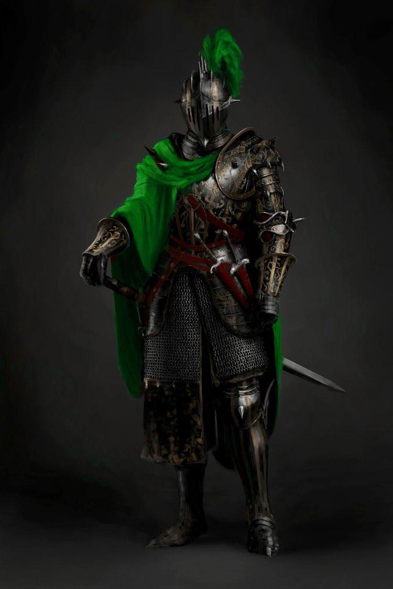
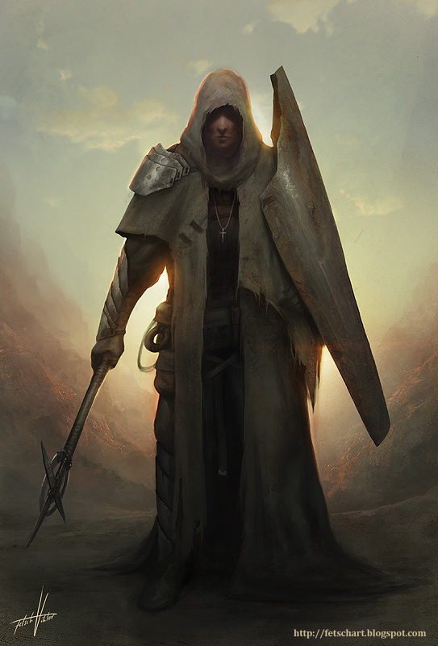
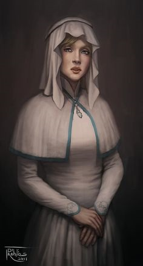
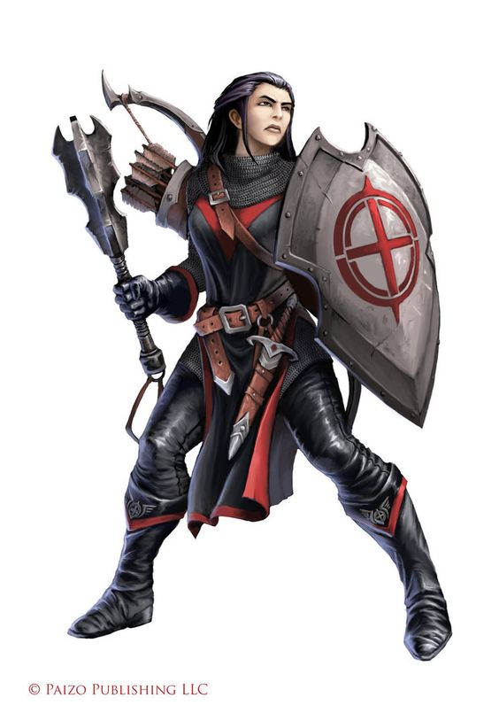
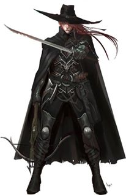
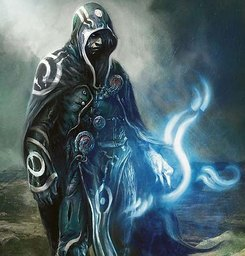
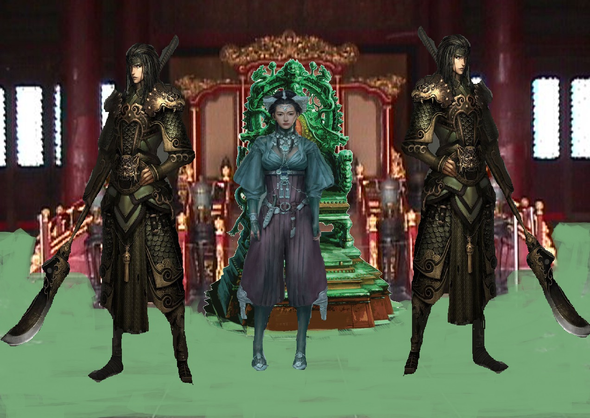

# Companies

Throughout my travels across the lands, I have had the opportunity to observe the forming of many organizations of peoples. Some, of course, were very specific to a race; however, many were orders which accepted members of all sorts.  

The wheel turns, and ages come and pass. The Gods weave our stories as they will, and these organizations are key players in their stories.  

## The Gallant {-}  

A mercenary troop, boasting some 1,500 members. They are expensive though will fight for whoever has the most coin. They have been around for nearly 800 years as an organization, and have won great respect and acclaim in that time.  

One oddity of the Gallant is they will either tattoo or place ribbons on their armor of the battles each individual was in.  

  

## The Order of Fire {-}  

These people are fanatics, who are known to burn themselves and others to show their devotion to the god of fire. They have been know to attack villages and temples of other gods.  

The rankings with in the cult are given to the most devoted. Their leader, a powerful fire mage it's said, have burned his entire body and is horribly scared. They call him the purified one.  

The "Flame knights" are the elite swordsmen of the cult and have as well extensively burned themselves. Initiates are called flame acolytes and have yet to commit to the flames.  

  

Currently, the Kingdom of Solen considers them criminals and is actively seeking them out within their borders.  

## The Guardians {-}  

These people fancy themselves protectors of nature and the natural order. Additionally, many of these members worship Noxel, or are paladins who have taken the oath of the ancients.  

  

## Brothers in Arms {-}  

They are a extension of the Makers Temple. They are called in when the Faith or the faithful need protection.  

Or where heresy has grown to great.  

  

## Sisters of Mercy {-}  

A monastic order of women that serve the goddess Atris. They attend to the sick and wounded in most city's and villages.  

  

## The Crimson Order {-}  

A organization of mostly clerics that have taken a solemn oath to rid the world of evil. They travel in small groups usually no more then 10. Members of the order ware black and red.  

  

## The Witch Hunters {-}  

Seek out and find all that do evil and bring them to swift justice. They act as a independent order with their own hierarchy though many see them and an extension to the Temple of Ayix. They have been around for several thousand years.  

  

## The Keepers {-}  

Perhaps the most enigmatic order in all of Elestra.  

Little is known of them, they show up in different points in history to give guidance to generals and leaders or to steal away powerful artifacts and people. They seem to be a powerful group of mages and legend says they have their own city that they teleport around the world. They seek out and recruit their own members.  

  

## Jade Warriors {-}  

An elite group of fighters trained from a young age. They use to be mercenary's though now protect the rulers of Jade town in Narsha.  

  

## The Group {-}  

An Adventurer for hire company that has existed for some 500 years with around 150 members they are willing to take any job for the right price. Their headquarters is located outside of the city of Camantha.  

## The Talon Company {-}  

Another Adventurer for hire company, they are in direct competition with "The Group" They have been around for 200 years.   